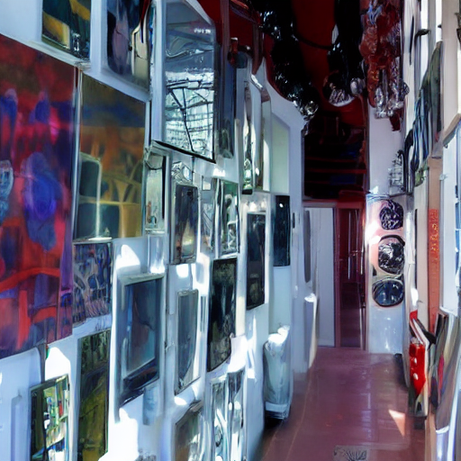
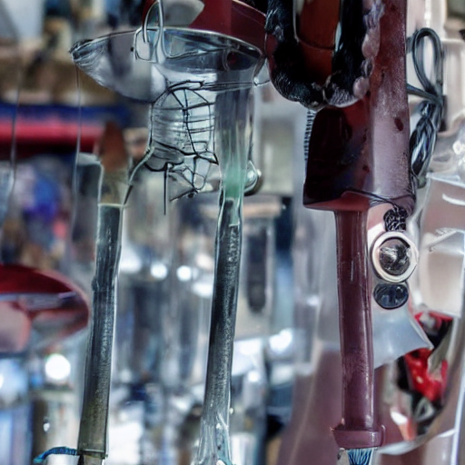

# Table with comparison between different text to image models

## The comparison was conducted using Google Colab on an A100 GPU with prompts of approximately ±12 tokens.

| Name                                     | Avg. infer time | Score* | Num. Inference Steps |
|------------------------------------------|-----------------|--------|----------------------|
| stabilityai/sdxl-turbo                   | 2.6 seconds     | 5/10   | 20                   |
| black-forest-labs/FLUX.1-dev             | 22  seconds     | 9/10   | 20                   |
| black-forest-labs/FLUX.1-schnell         | 22  seconds     | 8/10   | 20                   |
| sd-legacy/stable-diffusion-v1-5          | 0   seconds     | 2/10   | 20                   |
| stabilityai/stable-diffusion-xl-base-1.0 | 1   second      | 1/10   | 20                   |
| CompVis/stable-diffusion-v1-4            | 0   seconds     | 2/10   | 20                   |
| stabilityai/sdxl-turbo**                 | 0   seconds     | 8/10   | 2                    |
| stabilityai/stable-diffusion-xl-base-1.0 | 0   seconds     | 0/10   | 2                    |
| sd-legacy/stable-diffusion-v1-5          | 2   seconds     | 4/10   | 50                   |
| CompVis/stable-diffusion-v1-4            | 2   seconds     | 3/10   | 50                   |
| stabilityai/stable-diffusion-xl-base-1.0 | 5   seconds     | 1/10   | 50                   |

__\*__ Subjective  
__\*\*__ Best

  
*Figure 1: stabilityai/sdxl-turbo, 2 steps, "Art"*

  
*Figure 2: stabilityai/sdxl-turbo, 2 steps, "Tools"*

  
*Figure 3: black-forest-labs/FLUX.1-dev, 20 steps, "Art"*

  
*Figure 4: black-forest-labs/FLUX.1-dev, 20 steps, "Tools"*

  
*Figure 5: black-forest-labs/FLUX.1-schnell, 20 steps, "Art"*

  
*Figure 6: black-forest-labs/FLUX.1-schnell, 20 steps, "Tools"*

  
*Figure 7: sd-legacy/stable-diffusion-v1-5, 50 steps, "Art"*

  
*Figure 8: sd-legacy/stable-diffusion-v1-5, 50 steps, "Tools"*